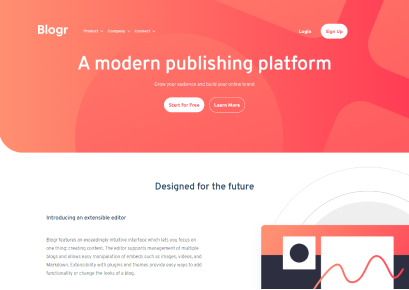

# Frontend Mentor - Blogr landing page solution

This is a solution to the [Blogr landing page challenge on Frontend Mentor](https://www.frontendmentor.io/challenges/blogr-landing-page-EX2RLAApP). Frontend Mentor challenges help you improve your coding skills by building realistic projects. 

## Table of contents

- [Overview](#overview)
  - [The challenge](#the-challenge)
  - [Screenshot](#screenshot)
  - [Links](#links)
- [My process](#my-process)
  - [Built with](#built-with)
  - [What I learned](#what-i-learned)
  - [Continued development](#continued-development)
- [Author](#author)

**Note: Delete this note and update the table of contents based on what sections you keep.**

## Overview

### The challenge

Users should be able to:

- View the optimal layout for the site depending on their device's screen size
- See hover states for all interactive elements on the page

### Screenshot

### Links

- Solution URL: [https://www.frontendmentor.io/solutions/responsive-landing-page-using-sass-TjEmZFIj_](https://www.frontendmentor.io/solutions/responsive-landing-page-using-sass-TjEmZFIj_)
- Live Site URL: [https://blogr-landr.netlify.app/](https://blogr-landr.netlify.app/)

## My process

### Built with

- Semantic HTML5 markup
- SASS
- Flexbox

### What I learned

This was my first time using SASS for a major project. I love how much more organized the stylesheet is, so much easier to find what I'm looking for. I learned that I really need to sit down and focus on the differences between mobile and desktop views before getting started. I definitely had to restructure parts of the design. This was my first time using different graphics based on screen size.

### Continued development

My solution for responsively switching out graphics could be more elegant

## Author

- Website - [Michael Winser](https://www.mwinser.com)
- Frontend Mentor - [@mwinser](https://www.frontendmentor.io/profile/mwinser)
- Twitter - [@winsaurus](https://www.twitter.com/winsaurus)